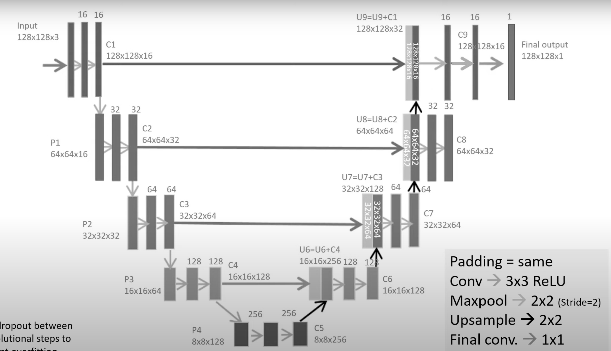

# Soil erosion detection

## Task

    Soil erosion is a really unwanted process that spoils huge areas of fertile land. Your task is to train model for erosion detection.

    What do you have

        -	Sentinel2 tile (T36UXV_20200406T083559_TCI_10m.jp2);
        -	Masks with soil erosion for this tile (masks directory);

    What should we get

    As usual it should be github repository that contains:
        -	jupyter notebook with data analysis;
        -	script for model training (preferably tf.keras);
        -	readme file;
        -	requirements.txt file;
        -	solution report. This is the most important part.  
        We expect here not only solution description but also your proposals and result of research  
        in different papers about soil erosion detection problem. In other words - what can help us  
        to solve problem in the most effective way.

## Solution

    The solution contains:
        - data analysis jupyter notebook (soil_erosion.ipynb); 
        - script for model training using tf.keras (model.py);
        - solution report (report.pdf).
    
* The problem of soil erosion detection is one of the tasks of image segmentation.
* To solve this problem, a CNN model with U-Net architecture was used.




* The model highlights many more areas of erosion in the images, which were not present in original masks and can really be seen by comparing the original images and the predicted masks.
* The model detects not only natural erosion, but also anthropogenic erosion.
* The model works quite well in most of the test cases
* Future analysis and improvements can be made to improve model performance.


## Installation and usage

Make sure you have already installed **Python3** interpreter and **git**. You can then run the following commands to get the scripts on your computer:

```
git clone https://github.com/lezhocheck/quantum_ds_task.git
```

After cloning the repository, make sure you have installed all the dependencies for the conda environment (listed in *path_to_local_repository://task_4/requirements.txt* file).  

**Note: replace all *path_to_local_repository://* with the actual path to the local repository on your machine.**  

To install all these dependencies, just run:

```
pip install -r path_to_local_repository://task_4/requirements.txt
```

**After installing all the requirements, copy the *masks/...* folder and *Sentinel2 tile* image to the *data/...* folder. Please, do not rename any of these files.**


### Model

To train the model, use:

```
python path_to_local_repository://task_4/model.py
``` 

**Note: please note that the *model.py* has dependencies on the *data/feed/...* folder that is generated by *soil_erosion.ipynb* based on input files in the *task_4/data/...* directory.**


### Jupyter notebook

To run **soil_erosion.ipynb**, start the jupyter kernel and re-run all cells.  
For more information see: https://jupyter-notebook-beginner-guide.readthedocs.io/en/latest/execute.html  

**Note: please note that the *soil_erosion.ipynb* depends on the contents of the *data/...* folder as well as *history.save*, *model_structure.jpg*, and *soil_erosion_model.h5* files. So, if you change the location or rename one of them, you should update the corresponding dependencies in the *soil_erosion.ipynb.***

## Solution report

Please see the solution report (report.pdf), which you can find at the root of this directory.
